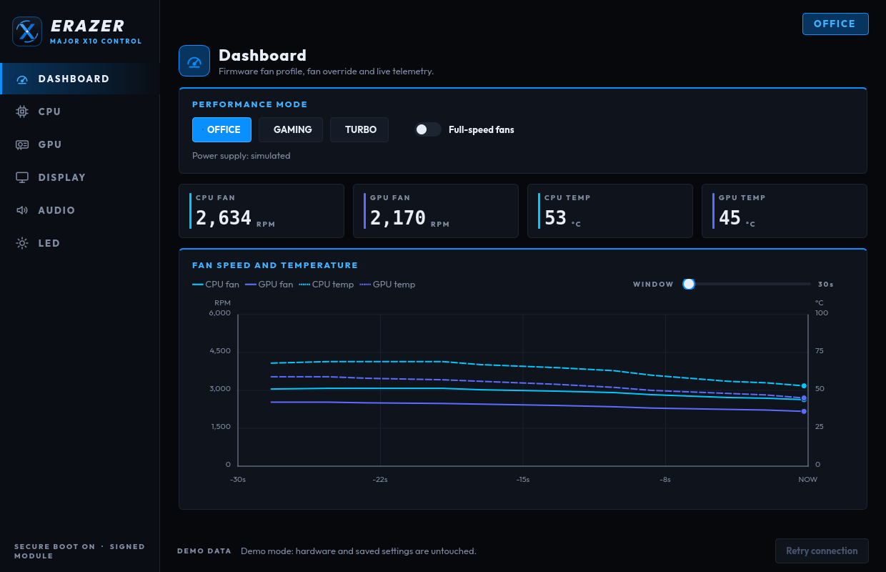
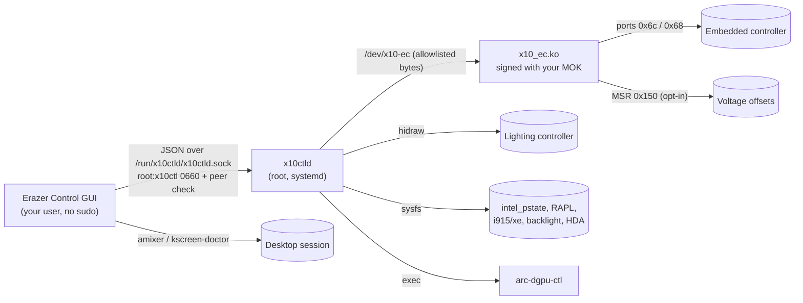

<p align="center">
  
</p>

<h1 align="center">Erazer Control</h1>

<p align="center">
  An unofficial Linux control center for the MEDION Erazer Major X10.<br>
  Fans, CPU, GPU, display, audio and lighting in one app, with Secure Boot on and no sudo.
</p>

<p align="center">
  <a href="https://github.com/Dane64/medion-erazer-major-x10-ec/actions/workflows/ci.yml"></a>
  <a href="https://github.com/Dane64/medion-erazer-major-x10-ec/releases"></a>
  <a href="LICENSE"></a>
</p>



> [!NOTE]
> This project is not affiliated with or endorsed by MEDION. It only runs on the
> Erazer Major X10. The kernel module, the daemon and the lighting backend each
> check the machine's identity and refuse to start anywhere else.

## Features

| Page | What you can control |
|---|---|
| **Dashboard** | Office / Gaming / Turbo firmware profile, full-speed fans, live fan RPM and temperatures with 30 s to 10 min of history |
| **CPU** | Turbo boost, governor, energy-performance preference, performance %, P-core / E-core frequency limits, RAPL power limits, optional voltage offsets |
| **GPU** | Discrete Arc GPU on/off (through `arc-dgpu-ctl`), runtime-PM state, frequency limits for iGPU and dGPU, dGPU power limit |
| **Display** | Backlight, refresh rate and VRR (KDE Plasma), panel overclock through an EDID override |
| **Audio** | Every writable mixer control the codec exposes, HDA power saving |
| **LED** | Per-zone color and on/off, brightness, all on / all off |

Every page can re-apply its settings when the daemon starts. See the
[user guide](docs/user-guide.md) for details on each control.

### What the hardware does *not* allow

- **No custom fan curves or RPM targets.** The firmware only offers its profiles and full speed.
- **No Arc GPU voltage or clocks above the driver maximum.**
- **Undervolting may be locked** by the firmware. The app detects this and says so instead of pretending.
- **Panel overclock is limited** by the EDID format and the panel itself.

## Install

On Debian, Ubuntu and derivatives:

```bash
git clone --recurse-submodules https://github.com/Dane64/medion-erazer-major-x10-ec.git
cd medion-erazer-major-x10-ec
sudo scripts/install.sh            # add --enable-undervolt to expose voltage offsets
```

Or download `medion_erazer_major_x10_ec-<version>.tar.gz` from the
[latest release](https://github.com/Dane64/medion-erazer-major-x10-ec/releases),
extract it and run `sudo bash scripts/install.sh` inside the folder.

The installer builds and signs the `x10_ec` kernel module with DKMS, installs
the `x10ctld` service, the app, its menu entry and icon, and the bundled
`arc-dgpu-ctl`. It creates the `x10ctl` group and adds you to it.

With Secure Boot enabled you enrol the signing key once:

1. Choose a one-time password when `mokutil` asks.
2. Reboot. In the blue **MokManager** screen pick *Enroll MOK -> Continue -> Yes*, enter the password and reboot.
3. Log in again (for the new group) and start **Erazer Control** from the application menu.

Check that everything is running:

```bash
systemctl status x10ctld           # active (running)
modinfo -F signer x10_ec           # your MOK name
```

Remove everything with `sudo scripts/uninstall.sh`. Details and troubleshooting
are in [Secure Boot and MOK](docs/secure-boot.md).

### Try it without the laptop

```bash
uv sync --locked
uv run --no-sync x10-control --demo
```

Demo mode simulates the daemon. Nothing is read, written or saved.

## How it works



The GUI never touches hardware itself. It talks to the `x10ctld` daemon over a
local socket that only members of the `x10ctl` group can open. With Secure Boot
on, kernel lockdown blocks raw port and MSR access even for root, so the small
signed **x10_ec** module forwards only an allowlist of documented EC commands
and, if you opt in, bounded and readback-verified voltage offsets.

## Documentation

| Guide | Contents |
|---|---|
| [User guide](docs/user-guide.md) | First start, every page, safety notes, troubleshooting |
| [Secure Boot and MOK](docs/secure-boot.md) | Signing, key enrolment, verification |
| [Building from source](docs/building.md) | Development setup, tests, kernel module, packages |
| [Protocol reference](docs/protocol.md) | EC and lighting commands, kernel allowlist, voltage mailbox |
| [Contributing](CONTRIBUTING.md) | Code layout, conventions, pull requests |
| [Releases](docs/releases.md) | Versioning and the release procedure |
| [Changelog](CHANGELOG.md) | What changed in each version |

## License

Apache-2.0 for the application. The kernel module in [`kernel/`](kernel) is
GPL-2.0-only because it links against the Linux kernel. The bundled Outfit
typeface is licensed under the [SIL Open Font License 1.1](medion_fan_control/assets/fonts/OFL.txt).
`arc-dgpu-ctl` in [`ext/`](ext/arc-dgpu-ctl) carries its own license.
