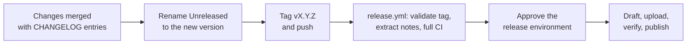

# Releases

[Back to the project overview](../README.md)

Packages are published to GitHub Releases, not PyPI. Every release contains
exactly three files:

| Asset | Purpose |
|---|---|
| `medion_erazer_major_x10_ec-<version>.tar.gz` | Complete source including `ext/arc-dgpu-ctl`; users extract it and run `sudo bash scripts/install.sh` |
| `medion_erazer_major_x10_ec-<version>-py3-none-any.whl` | App and daemon only, for a manual or demo install |
| `SHA256SUMS` | Checksums of both |

## Release in short



## One-time repository setup

Workflow files alone cannot enforce repository protection. Before publishing,
maintainers should configure these GitHub settings:

| Setting | Required policy |
| --- | --- |
| Default branch ruleset | Require pull requests and the **Quality gate** status check before merging |
| Tag ruleset for `v*` | Restrict tag creation to maintainers; prevent updating or deleting published version tags |
| Release settings | Enable release immutability to protect published tags and assets from manual replacement as well |
| `release` environment | Configure required reviewers and allow deployment only from protected version tags |
| Actions permissions | Enable the pinned Actions used by the workflows and permit the release job's `contents: write` token |
| Labels | Run the **Sync labels** workflow once; it applies `.github/labels.yml`, which the generated-notes categories in `.github/release.yml` rely on |

The release job names the `release` environment but cannot add its approval
rules. Without repository-side configuration, environment approval is not
enforced. Dependabot opens weekly updates for Actions, locked Python
dependencies and the `arc-dgpu-ctl` submodule; review those through the same
CI pipeline. Review the pinned `uv` version in the CI setup steps when updating
build tooling.

## Version policy

Hatch VCS derives the package version from Git. Accepted release tags are:

```text
v0.1.0
v0.2.0a1
v0.2.0b1
v0.2.0rc1
```

Use `vMAJOR.MINOR.PATCH`, optionally followed by `aN`, `bN`, or `rcN`, without
leading zeroes in numeric components. Prerelease tags produce GitHub
prereleases. Development or dirty-checkout versions are valid for local
builds but cannot pass the version check for a release tag.

| Bump | When |
|---|---|
| **major** | Install layout, configuration or socket protocol changes incompatibly |
| **minor** | New controls, pages or supported interfaces |
| **patch** | Fixes and documentation |

Do not move or reuse a published tag. Fix a broken release with a new version.

## Prepare and publish

Start from a clean, up-to-date default branch containing the reviewed changes.
The release workflow rejects tags whose commits are not on that branch.

1. Move the `## [Unreleased]` entries in [CHANGELOG.md](../CHANGELOG.md) under a
   new heading `## [0.1.0] - YYYY-MM-DD` and leave an empty `## [Unreleased]`
   above it. A final release without a matching section is rejected;
   prereleases fall back to GitHub's generated notes.
2. Preview the notes and run the same checks as CI (use an empty `dist/`):

   ```bash
   uv run --no-sync python tools/release.py notes v0.1.0
   uv sync --locked --group build
   uv run --no-sync python -m unittest discover -s tests -v
   uv build --no-build-isolation
   uv run --no-sync python tools/release.py check dist
   ```

3. Merge the changelog commit, then create and push an annotated tag on it:

   ```bash
   git tag -a v0.1.0 -m "Release 0.1.0"
   git push origin v0.1.0
   ```

Use a signed tag instead where your maintainer signing setup supports it.
Do not publish a local development build manually: the workflow rebuilds the
tagged source and publishes only its validated artifacts.

## Automated pipeline

| Stage | Safeguards |
| --- | --- |
| Tag validation | Canonical version format, default-branch ancestry, and a CHANGELOG section for final releases |
| Shared CI | Same reusable workflow as `main` pushes and pull requests; Python 3.11-3.14 tests, kernel build with `-Werror`, shellcheck, desktop/systemd/udev validation, and the submodule's own checks |
| Build | Locked build group, no build isolation that could resolve newer backend dependencies, complete Git history, and `SOURCE_DATE_EPOCH` from the source commit |
| Package validation | Matching tag/wheel/sdist versions, application modules and assets, launcher, license, maintained source files including `ext/arc-dgpu-ctl`, and no generated or unrelated archive content |
| Installed-package exercise | Fresh environment with hash-locked runtime dependencies; launcher and GUI tests run outside the source checkout |
| Publication | Approved environment when configured, artifact checksum verification, unchanged remote tag, CHANGELOG notes (or generated notes for prereleases), complete draft assets, then publication |

The default `uv build` operation builds the sdist first and the wheel from that
sdist. This exercises the source package without depending on files available
only in the checkout. The release workflow downloads those same checked
artifacts; it does not build a second, different package during publication.

Jobs have timeouts. Ordinary CI cancels superseded branch runs, while release
runs are serialized per tag and are not cancelled mid-publication. Actions are
pinned to immutable commits. Only the publication job has write access, and it
does not check out or execute project source.

## Failed runs and retries

A failure in the shared CI pipeline prevents publication. A failed upload
leaves a draft rather than exposing a partial public release. Re-run failed
jobs after resolving transient infrastructure problems; a retry can replace
assets in the existing draft and publishes only when its asset list matches
the expected three files.

If a draft has extra manually uploaded assets, remove those extras from the
draft before retrying. The workflow will not publish an unexpected asset set.
Already-published releases are never overwritten by a re-run.

Artifacts are retained by Actions for seven days. If they have expired, rerun
the complete release workflow so validation and packaging execute again. If
source or dependency changes are required, merge the fix and create a new tag
instead of retargeting the failed one.

## Download verification and installation

Download the source archive and `SHA256SUMS` from the same release, verify,
extract and install:

```bash
sha256sum --check --ignore-missing SHA256SUMS
tar xf medion_erazer_major_x10_ec-0.1.0.tar.gz
cd medion_erazer_major_x10_ec-0.1.0
sudo bash scripts/install.sh
```

To only try the app, install the wheel into a dedicated environment as your
normal user:

```bash
uv venv --python 3.13 .venv
uv pip install --python .venv/bin/python medion_erazer_major_x10_ec-0.1.0-py3-none-any.whl
.venv/bin/x10-control --demo
```

Checksums detect damaged or mismatched downloads; they are not an independent
signature.
